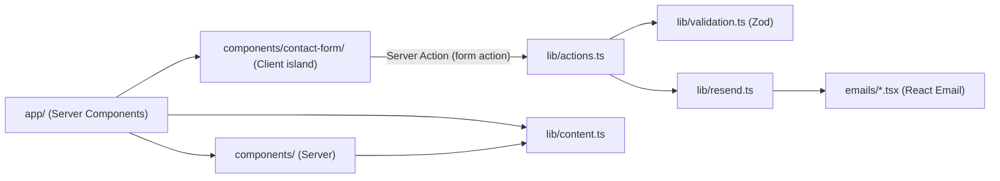

# Architecture Spine — Mister Steph On Sax

## Design Paradigm

**Server-first App Router.** Toute la page est rendue en Server Components (Hero, Écoute, Formules) — statique, pas de JavaScript client à charger pour la lire. Une seule exception, un **Client island** : le formulaire de contact/devis, seul élément avec état interactif (validation, feedback). `app/` porte les routes et les Server Components ; `components/contact-form/` porte l'unique Client Component ; `lib/` porte la logique partagée serveur (contenu, email, validation) ; `emails/` porte les templates React Email.



## Invariants & Rules

### AD-1 — Frontière Server/Client unique

- **Binds:** toutes les sections de la page (Hero, Écoute, Formules, Contact)
- **Prevents:** un futur contributeur qui rend une section entière `'use client'` par habitude, perdant le rendu statique et le SEO d'une page marketing
- **Rule:** seul `components/contact-form/` (et sa région live de feedback) porte `'use client'`. Hero, Écoute, Formules restent des Server Components — aucune interactivité, aucun état React dedans.

### AD-2 — Soumission du formulaire via Server Action, jamais de route API dédiée

- **Binds:** `components/contact-form/`, `lib/actions.ts`
- **Prevents:** un deuxième chemin de soumission (fetch vers une route API `app/api/contact/route.ts`) qui dupliquerait la logique de validation/envoi et pourrait diverger de la Server Action
- **Rule:** `lib/actions.ts` expose une unique Server Action (`'use server'`) passée à `<form action={...}>`. Aucune route API n'est créée pour ce flux.

### AD-3 — Contrat de validation partagé (Zod), jamais de confiance au client seul

- **Binds:** `components/contact-form/`, `lib/actions.ts`, `lib/validation.ts`
- **Prevents:** deux implémentations de règles de validation qui divergent (ex. le client accepte une date que le serveur rejette) ; deux façons incompatibles de représenter une erreur non liée à un champ (ex. un envoi Resend qui échoue) ; deux signatures différentes pour brancher la Server Action sur le formulaire
- **Rule:** un unique schéma Zod dans `lib/validation.ts`, importé à la fois par le Client Component (validation au blur, cf. `EXPERIENCE.md § Component Patterns`) et par la Server Action (revalidation systématique, jamais sautée même si le client a déjà validé). L'énum Zod du champ "Type de prestation" est **dérivée** du tableau exporté par `lib/content.ts` (`z.enum(prestationTypes.map(p => p.value))`) — jamais redéclarée à la main, pour ne pas diverger de la liste affichée dans le `<select>`. La Server Action est branchée via `useActionState` (signature `(prevState, formData) => result`, pas un `<form action={fn}>` bare) et retourne exactement :
  ```ts
  { ok: true }
  | { ok: false; kind: 'validation'; fieldErrors: Record<string, string> }
  | { ok: false; kind: 'technical'; message: string }
  ```
  `kind: 'technical'` couvre tout échec après validation (ex. l'envoi Resend qui échoue, cf. AD-4) et se mappe à l'état `role="alert"` d'`EXPERIENCE.md`, distinct des erreurs de champ (`role` implicite via `aria-describedby`/`aria-invalid`).

### AD-4 — Email : Resend, notification prioritaire + confirmation best-effort, templates React Email

- **Binds:** `lib/resend.ts`, `lib/actions.ts`, `emails/`
- **Prevents:** un second provider d'email introduit plus tard pour un besoin ponctuel (ex. juste la confirmation), qui multiplierait les identifiants et les templates ; la perte silencieuse de la notification à Stephane si l'email de confirmation échoue ; des emails de test envoyés en vrai vers la boîte de Stephane depuis une Preview Vercel
- **Rule:** un seul client Resend (`lib/resend.ts`). **Deux appels `resend.emails.send()` distincts, jamais `batch.send()`** (le batch est atomique : un email invalide ferait échouer tout le lot, y compris la notification) — l'email de notification vers `process.env.CONTACT_TO_EMAIL` part **en premier et bloque le succès de la soumission** ; l'email de confirmation vers l'adresse saisie par le visiteur est **best-effort** (son échec est loggé mais ne fait pas échouer la soumission — le visiteur a déjà l'accusé de réception à l'écran, cf. `EXPERIENCE.md`). L'adresse d'expédition vit dans `process.env.RESEND_FROM_EMAIL` (voir AD-7), jamais en dur dans `lib/resend.ts`. Les deux corps d'email sont des composants du paquet unifié `react-email` (voir Stack — pas `@react-email/components`, déprécié) dans `emails/`, jamais du HTML en chaîne de caractères. **Hors Production** (`process.env.VERCEL_ENV !== 'production'`), aucun email réel n'est envoyé — la Server Action logue le payload et retourne `{ ok: true }` comme si l'envoi avait réussi, pour que les Previews restent testables sans polluer la boîte de Stephane.

### AD-5 — Contenu éditorial centralisé, jamais dispersé dans le JSX

- **Binds:** cartes Formules, options du menu déroulant "Type de prestation", copy du bloc teaser Écoute, libellés des champs et bouton du formulaire de contact, texte des templates d'email (hors mentions purement techniques)
- **Prevents:** un texte modifié dans un composant qui laisse une occurrence obsolète ailleurs (ex. liste des types de prestation dupliquée entre le `<select>` et un email de confirmation qui la re-décrit) ; deux formes différentes du même contenu définies indépendamment par deux unités qui construisent en parallèle
- **Rule:** tout texte qu'un Stephane non-développeur pourrait raisonnablement vouloir modifier un jour (offres, libellés de formulaire, copy des emails, texte du teaser) vit dans `lib/content.ts`, typé, importé par les composants ET par les templates d'email qui en ont besoin — seules les chaînes strictement techniques (attributs ARIA, valeurs internes) restent en dur. Pas de CMS, pas de fichier de traduction — une seule langue (français). Formes exportées minimales (noms stables, aucune autre unité n'en redéfinit une variante) :
  ```ts
  export const prestationTypes: { value: string; label: string }[]
  export const formules: { titre: string; description: string }[]
  export const listenTeaser: { title: string; body: string }
  export const contactFormLabels: { nom: string; prenom: string; date: string; typePrestation: string; lieu: string; submit: string }
  ```

### AD-6 — Tokens visuels : Tailwind v4 `@theme`, sourcés de `DESIGN.md`, jamais de hex en dur

- **Binds:** tout composant qui pose une couleur, une police ou un rayon
- **Prevents:** un composant qui réintroduit une couleur proche mais différente (ex. un autre vert) parce que `DESIGN.md` n'était pas sous les yeux
- **Rule:** `app/globals.css` définit un bloc `@theme` unique qui reprend un-à-un **toutes** les catégories de tokens présentes dans le frontmatter de `DESIGN.md` (`colors`, `typography`, `rounded`, `spacing`, et toute catégorie que `DESIGN.md` viendrait à ajouter) — `--color-navy`, `--color-gold`, `--font-display`, `--radius-sm`, `--spacing-section-y`, etc. Tout composant utilise les classes Tailwind générées (`bg-navy`, `text-gold`, `font-display`, `p-section-y`) — jamais une valeur hex, un nom de police, ou une valeur arbitraire (`p-[23px]`) en dur dans le JSX ou le CSS.

### AD-7 — Secrets en variables d'environnement, jamais committés

- **Binds:** `RESEND_API_KEY`, `CONTACT_TO_EMAIL`, `RESEND_FROM_EMAIL`
- **Prevents:** une clé Resend, l'adresse email de Stephane, ou l'adresse d'expédition committée dans le dépôt (fuite publique si le repo devient public un jour) ; une nouvelle unité qui invente son propre nom de variable pour une valeur qui existe déjà
- **Rule:** ces trois valeurs vivent exclusivement dans les variables d'environnement Vercel (Production + Preview). `.env.local` est gitignored ; `.env.example` documente les clés attendues sans valeurs réelles. Toute nouvelle valeur sensible ajoutée plus tard (ex. une clé de service anti-spam, cf. AD-8) suit la même convention et est ajoutée à cette liste, jamais nommée au hasard par l'unité qui en a besoin en premier.

### AD-8 — Anti-abus minimal sur le formulaire public, sans nouveau service ni nouvelle route

- **Binds:** `components/contact-form/`, `lib/actions.ts`
- **Prevents:** une unité qui ajoute une route API dédiée à une vérification captcha (en tension avec AD-2), une autre qui fait un check inline différent — deux mécanismes concurrents ; du spam qui déclenche des envois Resend payants et pollue la boîte de Stephane
- **Rule:** un unique champ honeypot (input caché, jamais rempli par un humain) fait partie du même schéma Zod que les autres champs et est vérifié à l'intérieur de la Server Action existante (`lib/actions.ts`) — aucune route dédiée, aucun service tiers (Turnstile/reCAPTCHA), aucune nouvelle variable d'environnement. Un honeypot rempli renvoie silencieusement `{ ok: true }` sans envoyer d'email (l'utilisateur légitime ne voit jamais d'erreur). Rate-limiting et CAPTCHA restent explicitement différés (voir Deferred) : **aucune unité n'ajoute de mécanisme supplémentaire avant que cette AD soit révisée**, même si du spam apparaît en production — la révision se fait ici, pas par ajout ad hoc.

## Consistency Conventions

| Concern | Convention |
| --- | --- |
| Naming (fichiers, composants) | Fichiers composants en kebab-case (`contact-form.tsx`), export du composant en PascalCase (`export function ContactForm`) — cohérent avec le Structural Seed ci-dessous. Fichiers utilitaires en kebab-case (`lib/validation.ts`). Un composant par fichier. |
| Data & formats | Retour de Server Action : voir la forme exacte AD-3 (`kind: 'validation' \| 'technical'`). Emails : composants `react-email`, jamais de template string HTML. |
| State & cross-cutting | Aucun state global (pas de store, pas de contexte React) — le seul état vit dans `ContactForm` ; tout sous-composant de feedback (région live) reste sous `components/contact-form/`, reçoit son état en props, ne détient jamais d'état propre (voir AD-1). Logs d'erreur d'envoi via `console.error` côté serveur (logs de fonction Vercel) ; pas de service de logging tiers pour ce périmètre. |

## Stack

| Name | Version |
| --- | --- |
| Next.js (App Router) | 16.3.4 |
| React / React DOM | 19.2.x (bundled avec Next.js 16) |
| TypeScript | 7.0.x (courant ; Next.js 16 requiert seulement ≥5.1, mais rien ne justifie de rester en 5.x) |
| Tailwind CSS | v4 (`@theme` CSS-first) |
| Zod | 4.5.4 |
| Resend (SDK `resend`, npm) | 6.26.0 |
| `react-email` (paquet unifié) | 6.9.3 — **pas** `@react-email/components`, déprécié depuis React Email 6.0 (avril 2026) |
| Déploiement | Vercel (Production + Previews automatiques) |
| Email — domaine expéditeur | Domaine de Stephane, vérifié dans Resend (DNS) |

## Structural Seed

```text
app/
  layout.tsx           # <html lang="fr">, police (next/font), @theme importé
  page.tsx              # assemble Hero, Ecoute, Formules, ContactForm (Server Components)
  globals.css           # @theme — tokens DESIGN.md
components/
  hero.tsx
  listen-teaser.tsx
  formules.tsx
  contact-form/
    contact-form.tsx    # 'use client' — seul Client Component
lib/
  content.ts             # textes Formules, options select, copy teaser
  validation.ts          # schema Zod partage client/serveur
  actions.ts              # Server Action submitContactForm
  resend.ts               # client Resend (batch send)
emails/
  notification-email.tsx  # vers CONTACT_TO_EMAIL
  confirmation-email.tsx  # vers le visiteur
```

## Capability → Architecture Map

| Capability / Area | Lives in | Governed by |
| --- | --- | --- |
| Hero, Écoute, Formules (statiques) | `components/*.tsx`, `app/page.tsx` | AD-1, AD-6 |
| Formulaire de contact/devis | `components/contact-form/`, `lib/actions.ts`, `lib/validation.ts` | AD-1, AD-2, AD-3 |
| Envoi d'email (notification + confirmation) | `lib/resend.ts`, `emails/` | AD-4, AD-7 |
| Contenu éditorial (Formules, options select) | `lib/content.ts` | AD-5 |
| Anti-abus (honeypot) | `lib/actions.ts`, `lib/validation.ts` | AD-8 |

## Deferred

- **Intégration Cloudinary** — **résolu (2026-09-05), sans Cloudinary.** Une seule photo (Hero) existe pour l'instant ; elle est servie comme asset statique dans `public/` via `next/image` (optimisation, formats modernes et responsive intégrés à Next.js, zéro compte/service externe à configurer). Cloudinary resterait pertinent si le volume de photos/vidéos gérées par Stephane lui-même (sans passer par un déploiement) grossissait — à réévaluer si ce besoin apparaît.
- **Lecteur audio/vidéo fonctionnel** — la section Écoute reste un teaser statique tant qu'aucune démo n'est prête (cf. `EXPERIENCE.md`). Le choix du lecteur (natif `<audio>`, embed Instagram/SoundCloud) est différé jusqu'à ce que du contenu existe.
- **Internationalisation** — une seule langue (français) au lancement ; pas de structure i18n mise en place tant qu'un besoin réel n'apparaît pas.
- **Analytics/observabilité** — aucun outil de suivi (Vercel Analytics ou autre) n'a été demandé. **Prevents:** aucune unité n'ajoute de script d'analytics/tracking (y compris les défauts de scaffold Next.js/Vercel comme `@vercel/analytics`) avant que ce point soit explicitement tranché — l'ajouter en douce ouvrirait aussi une question RGPD/consentement cookies non traitée par cette spine. À rouvrir ensemble si Stephane veut mesurer le trafic/les conversions du formulaire.
- **Rate-limiting / CAPTCHA** — AD-8 couvre uniquement un honeypot au lancement ; si du spam apparaît malgré tout, la révision passe par cette spine (Update), pas par un ajout ad hoc dans une story.
